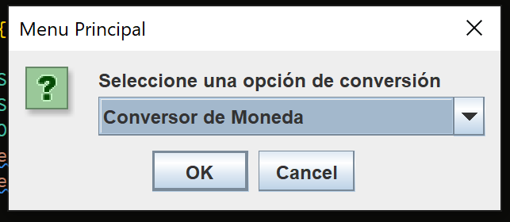

# Conversor

## Descripción

Este proyecto fue desarrollado durante el curso de Alura, la cual trata de un sencillo conversor de valores monetarios y de sistemas de numeración.

## Previsualización

## Construido con 🛠️

* Java 19.0.1

## Autor ✒️
* **Usui, José Fernando** - *Desarrollo del Programa*

## Contacto 📱
* Gmail: _joesesilvae@gmail.com_
